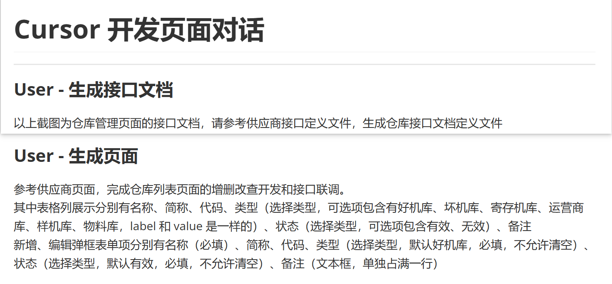
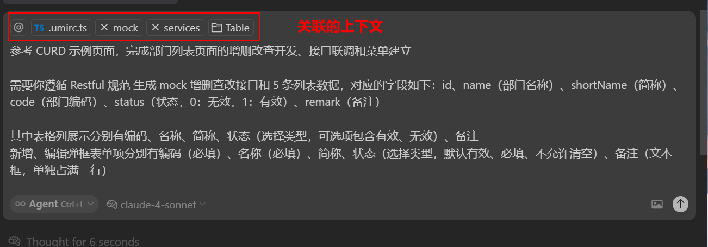

## 简介

[front-admin-template](http://code.bbkedu.com/BUSINESSIT/zht/front-admin-template) 是由 [@umijs/max](https://umijs.org/docs/max/introduce) 创建的前端项目，其中 CURD 示例实现了常见列表的增删查改功能，可供 Cursor 参考快速生成其他列表页面。

## 开发

```bash
# 克隆项目
git clone http://code.bbkedu.com/BUSINESSIT/zht/front-admin-template.git

# 进入项目目录
cd front-admin-template

# 安装依赖（建议使用 yarn）
npm install or yarn

# 运行
npm run start or yarn start
```

## 构建

```bash
npm run build or yarn build
```

## 项目目录

```
front-admin-template/
├── .vscode/                 VS Code 配置
├── .husky/                  Git Hooks 配置
├── node_modules/            依赖包
├── mock/                    模拟数据
│   └── userAPI.ts           用户接口模拟
├── src/                     源代码目录
│   ├── .umi/                运行时缓存
│   ├── assets/              静态资源
│   ├── components/          全局组件
│   ├── constants/           常量定义
│   ├── models/              全局状态
│   ├── pages/               页面文件
│   │   ├── Home/            首页
│   │   └── Table/           CRUD 示例页面
│   ├── services/            接口文件
│   ├── utils/               通用方法
│   └── app.ts               启动入口
├── .eslintrc.js             ESLint 配置
├── .gitignore               Git 忽略文件
├── .lintstagedrc            代码检查配置
├── .npmrc                   NPM 配置
├── .prettierignore          Prettier 忽略文件
├── .prettierrc              Prettier 配置
├── .stylelintrc.js          样式检查配置
├── .umirc.ts                Umi 配置文件
├── .yarnrc                  Yarn 配置
├── package.json             项目配置
├── README.md                项目说明
├── tsconfig.json            TypeScript 配置
├── typings.d.ts             类型定义
└── yarn.lock                依赖锁文件
```

## Cursor 实战示例



## 本项目实战示例



```bash
参考 CURD 示例页面，完成部门列表页面的增删改查开发、接口联调和菜单建立

需要你遵循 Restful 规范 生成 mock 增删查改接口和 5 条列表数据，对应的字段如下：id、name（部门名称）、shortName（简称）、code（部门编码）、status（状态，0：无效，1：有效）、remark（备注）

其中表格列展示分别有编码、名称、简称、状态（选择类型，可选项包含有效、无效）、备注
新增、编辑弹框表单项分别有编码（必填）、名称（必填）、简称、状态（选择类型，默认有效、必填、不允许清空）、备注（文本框，单独占满一行）
```
